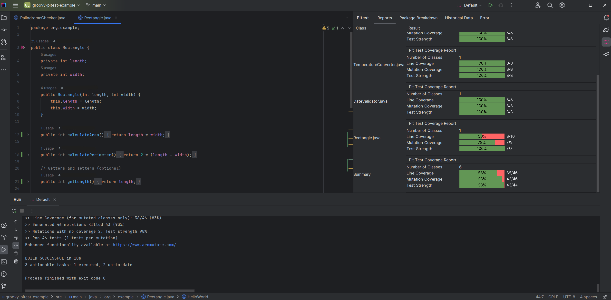
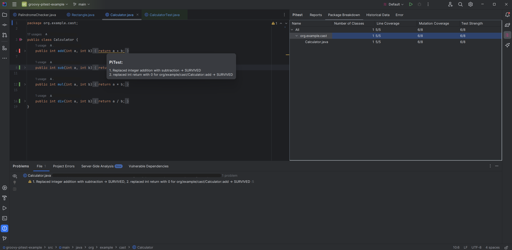

## Mutation Testing

### Pitest IDE Plugin – IntelliJ/Android Studio Integration

### Overview

The **Pitest IDE Plugin** brings the power of mutation testing directly into your IntelliJ IDEA or Android Studio workflow. It integrates [PIT](https://pitest.org/) mutation testing framework with the IDE, making it easy to run, configure, and analyze mutation tests without leaving your development environment.

#### Key Features

- **Run Mutation Tests from the Editor:**  
  Trigger mutation testing for classes or methods directly from the code editor via context menu or keyboard shortcuts.

- **Inline Results Visualization:**  
  See mutation results as inline annotations in your source code, highlighting killed and surviving mutations.

- **Tool Window Integration:**  
  View detailed mutation reports and coverage metrics in a dedicated IDE tool window.

- **Configurable Test Runs:**  
  Adjust mutators, verbosity, targeted classes/tests, and other PIT parameters from the IDE settings.

- **Surviving Mutations Inspection:**  
  Quickly identify and inspect mutations that survived your test suite, helping you improve test quality.

- **Multi-Module & Android Support:**  
  Works with standard JVM projects and Android projects (via the Android PIT plugin).

---

### Getting Started

#### 1. **Install the Plugin**

- Open IntelliJ IDEA or Android Studio.
- Go to **File > Settings** (or press `Ctrl + Alt + S`).
- Navigate to **Plugins**.
- Search for **Pitest IDE Plugin** in the Marketplace and install it.
- Restart your IDE.

#### 2. **Configure the Plugin**

- Go to **File > Settings > Tools > Pitest**.
- Set up PIT options, such as:
    - PIT installation location (if needed)
    - Mutators to use
    - Verbosity level
    - Target classes/tests
    - Output formats

#### 3. **Run Mutation Tests**

- Open a Java/Kotlin file.
- Place the cursor in the class or method you want to test.
- Right-click and select **Run Mutation Test for 'ClassName'** (or use the shortcut: `Alt + Shift + F10` / `Ctrl + Shift + F10`).

#### 4. **View Results**

- Results appear in the **Run** tool window and as inline annotations in the editor.
- Surviving mutations are highlighted for easy inspection.

---

### Advanced Usage

#### **Customizing PIT Parameters**

- The plugin allows you to override PIT configuration properties for each run.
- You can specify target classes/tests, mutators, thresholds, and more via the settings UI or per-run dialog.

#### **Android Project Support**

- For Android projects, the plugin detects and works with the [Android PIT plugin](https://github.com/koral--/gradle-pitest-plugin/).
- Limitations: PIT cannot mutate code in `/androidTest` (instrumented tests).

#### **Multi-Module Projects**

- The plugin automatically detects subprojects and applies mutation testing to the correct modules.
- Aggregated reports are supported if configured in your Gradle setup.

#### **Troubleshooting**

- If mutation tests do not run as expected, check the following:
    - PIT plugin is applied to your project (or Android PIT plugin for Android projects).
    - JUnit (or other test engine) is present in your test dependencies.
    - Output formats include `XML` for report parsing.
    - For Android: Only unit tests (`/test`) are supported, not instrumented tests (`/androidTest`).

---

### Example Workflows

#### **Mutating a Single Class**

- Use the context menu or shortcut to run mutation tests for a specific class.
- The plugin automatically sets the `targetClasses` and `targetTests` for PIT, so you don't need to edit your Gradle config.

#### **Analyzing Surviving Mutations**

- Inline annotations and the tool window show surviving mutations.
- Click on a mutation to see details, including the mutator, affected line, and description.

#### **Improving Test Strength**

- Use the plugin to iteratively refactor and improve your tests.
- Rerun mutation tests after each change to see if more mutations are killed.

---

### Limitations & Known Issues

- **Android Integration:** Only unit tests are supported; instrumented tests cannot be mutated.
- **Kotlin Support:** Some junk mutations may appear for Kotlin code due to PIT limitations. See [Known Issues with Kotlin](#known-issues-with-kotlin) above.
- **Gradle/Maven Detection:** The plugin relies on correct build tool configuration. Ensure PIT plugins are applied and compatible versions are used.

---

### Support & Contact

- [Discourse](https://discourse.eso.local/)
- [`eso.Project.HCP3-HMI.Pitest-Support`](mailto:eso.Project.HCP3-HMI.Pitest-Support@esolutions.de)

---

### Screenshots

---

### References

- [PIT Mutation Testing Framework](https://pitest.org/)
- [Android PIT Plugin](https://github.com/koral--/gradle-pitest-plugin/)
- [Pitest IDE Plugin Marketplace Page](../MarketplacePage/GettingStarted.html)

## Support/Contact

* [Discourse](https://discourse.eso.local/)
* [`eso.Project.HCP3-HMI.Pitest-Support`](mailto:eso.Project.HCP3-HMI.Pitest-Support@esolutions.de)